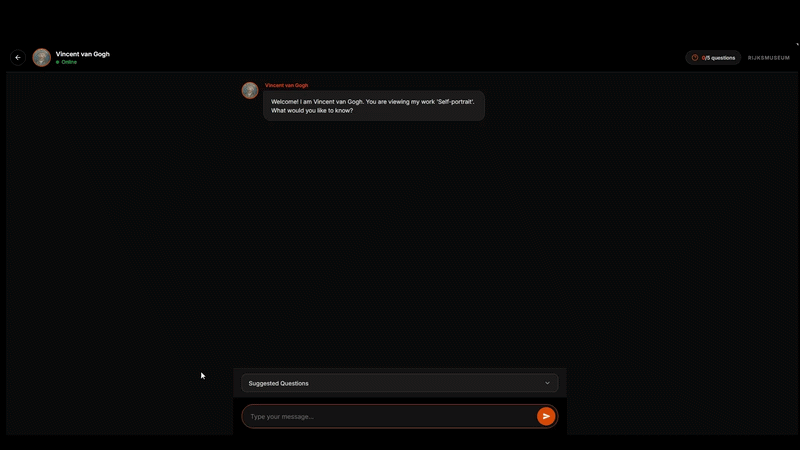

# Chatbot for the Rijksmuseum

This project is part of the Data Systems Project at the University of Amsterdam and focuses on designing and evaluating a chatbot that enables users to explore artworks of the Rijksmuseum.



To run the chatbot: 

* clone the project, then
```bash
cd Chatbot-for-the-Rijksmuseum
```
* Install requirements
```bash
pip install -r requirements.txt
```

* Add your .env file

* Test the question-answering pipeline: (Optional)
```bash
python -m src.question_answering
```
To launch the web interface:
```bash
uvicorn app:app --reload
```

You can also run the app using Docker:

Build image

```docker build -t rijksmuseum-app . ```


Run container

```
docker run -p 8000:8000 \
  -e OPENAI_API_KEY="your key" \
  rijksmuseum-app
```

The app will be available at http://localhost:8000
